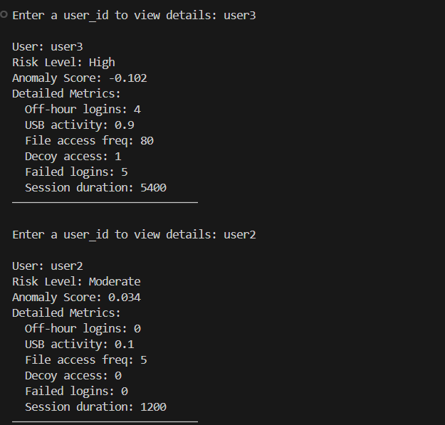
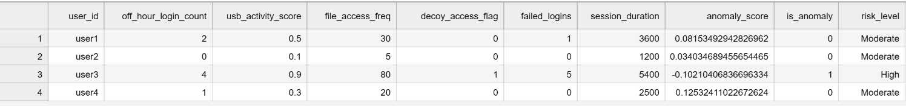
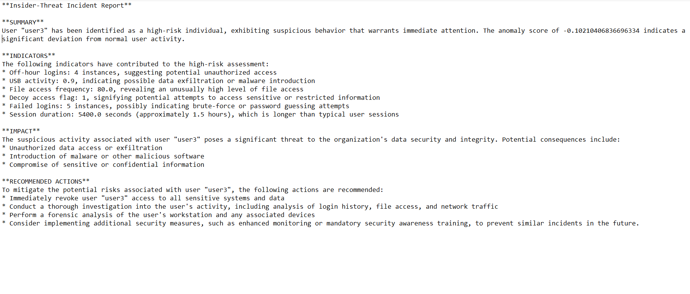
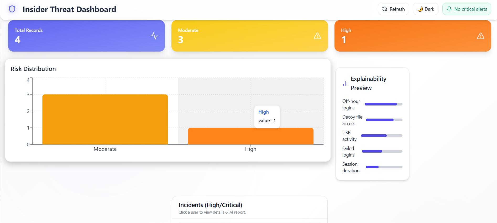
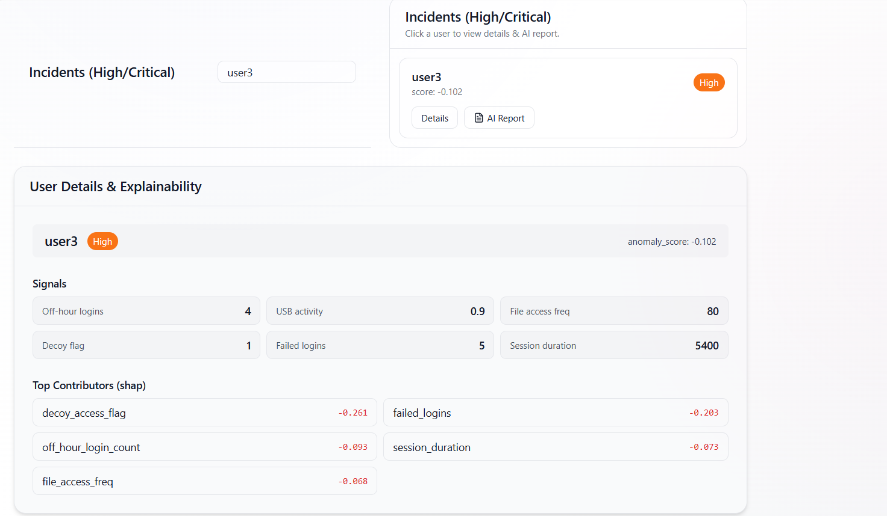
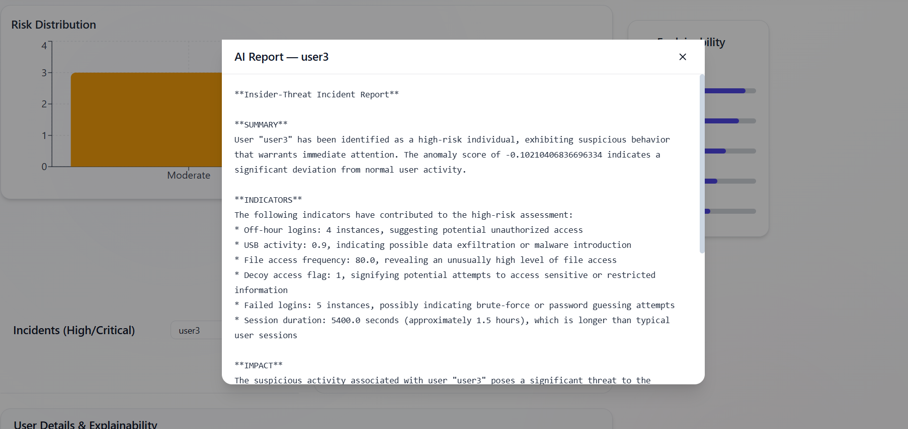
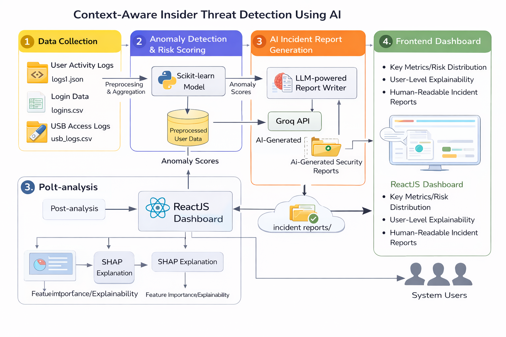

# SHIELD: Smart Hybrid Intelligent Engine for Log-based Detection

An AI-powered **Insider Threat and Anomaly Detection & Monitoring System** that analyzes multi-source logs to detect suspicious behavior, assign risk levels, and generate automated incident reports.

## 🚀 Features
- Multi-log analytics (logon, file, device, decoy)
- Anomaly detection using Isolation Forest
- Dynamic risk scoring (Low / Moderate / High / Critical)
- AI-generated incident reports (Groq LLM)
- Explainability preview for analyst insight
- Interactive React dashboard with alerts & charts

## 🧠 Tech Stack
**Backend:** Python, FastAPI, Scikit-learn, PyOD  
**Frontend:** React, TailwindCSS, Framer Motion, Recharts  
**AI:** Groq API (Llama 3.x)  
**Storage:** CSV (prototype)

## 📸 Project Outputs

## 📸 Model Outputs & AI Incident Reports

### 🔍 Anomaly Detection & Risk Scoring (Backend)
Terminal output showing detected anomalies and risk-level distribution after model inference.



---

### 📊 Risk-Scored Log Preview
Sample view of model output with anomaly scores mapped to human-readable risk levels.



---

### 🧾 AI-Generated Incident Report (Text Output)
LLM-generated insider threat incident report created from high-risk behavioral patterns.




## 🖥️ Frontend Dashboard & Explainability

### 📊 Insider Threat Dashboard Overview
Interactive dashboard displaying overall record counts, risk distribution, and severity indicators.



---

### 🔍 User-Level Explainability & Behavioral Signals
Detailed analyst view showing user-specific signals and SHAP-based feature contributions.



---

### 🧠 AI-Generated Incident Report (UI View)
AI-written incident report rendered directly inside the dashboard for analyst investigation.



## 🏗️ System Architecture & Data Flow

The following diagram illustrates the end-to-end architecture of the Context-Aware Insider Threat Detection system, showing how multi-source user activity logs are processed, analyzed using machine learning models, enriched with explainability and AI-generated reports, and finally visualized through a ReactJS dashboard.




## ▶️ How to Run
### Backend
```bash
cd insider-threat
.\venv\Scripts\activate
uvicorn backend.app:app --reload

### Frontend
cd frontend
npm install
npm run dev

## 📊 API Endpoints

- `/api/health`  
  Checks backend service status.

- `/api/summary`  
  Returns overall risk distribution and system statistics.

- `/api/incidents`  
  Fetches all High and Critical risk insider incidents.

- `/api/user/{user_id}`  
  Retrieves detailed behavior metrics and explainability data for a specific user.

- `/api/report/{user_id}`  
  Returns the AI-generated incident report for the selected user.


  Context-Aware-Insider-Threat-Detection/
│
├── data/
│   ├── raw/                    # Original datasets (Kaggle + synthetic logs)
│   ├── processed/              # Cleaned & feature-engineered data
│   │   └── combined_logs.csv
│   └── output/                 # Model outputs
│       ├── anomaly_results.csv
│       └── final_risk_scored_logs.csv
│
├── reports/
│   └── generated/              # AI-generated incident reports (.txt)
│
├── src/
│   ├── preprocessing/          # Log parsing & feature engineering
│   │   ├── logon_processor.py
│   │   ├── file_activity_processor.py
│   │   ├── device_activity_processor.py
│   │   └── decoy_tracker.py
│   │
│   ├── models/                 # ML models
│   │   ├── anomaly_detection.py
│   │   └── risk_scoring.py
│   │
│   ├── reporting/              # AI incident report generation
│   │   └── ai_reports_groq.py
│   │
│   └── day3_train_detect_risk.py  # End-to-end Day 3 pipeline
│
├── utils/
│   └── common.py               # Shared helpers (paths, column mapping, utils)
│
├── .env                        # API keys (NOT committed)
├── .gitignore
├── requirements.txt
└── README.md
|-assets/
└── screenshots/


🎯 Objective

To proactively detect insider threats using AI-driven behavioral analytics and provide automated, explainable incident intelligence.

📌 Status

Mini Project — Demo Ready
(Planned: DB persistence, full SHAP/LIME, deployment)

👤 Author

Rishab Pattanshetti
